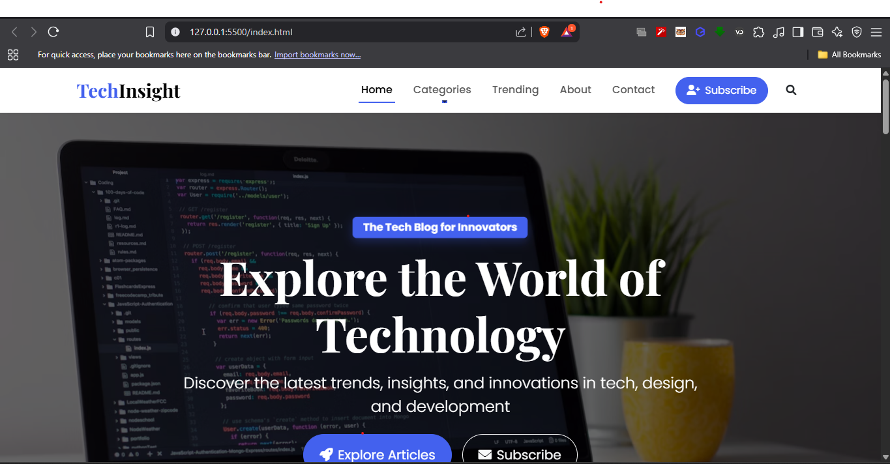

# TechInsight Blog

A modern, responsive blog website for technology enthusiasts, developers, and designers. TechInsight Blog provides a clean and attractive interface for sharing and discovering the latest trends, insights, and innovations in technology.



## Features

- **Modern Design**: Clean, minimalist design with a focus on content readability
- **Fully Responsive**: Optimized for all devices - mobile, tablet, and desktop
- **Bootstrap 5 Framework**: Built with the latest Bootstrap for robust layout and components
- **Animated Elements**: Subtle animations using AOS (Animate On Scroll) library
- **Blog Categories**: Organized content with filterable categories
- **Featured Posts**: Highlight important articles with the featured section
- **Newsletter Subscription**: Built-in subscription form for audience engagement
- **Search Functionality**: Easy content discovery with the search feature

## Technologies Used

- HTML5
- CSS3
- Bootstrap 5
- Font Awesome Icons
- Google Fonts
- AOS Animation Library
- JavaScript

## Getting Started

### Prerequisites

- A modern web browser (Chrome, Firefox, Safari, Edge)
- Basic knowledge of HTML and CSS (for customization)

### Installation

1. Clone the repository or download the ZIP file
   ```
   git clone https://github.com/yourusername/techinsight-blog.git
   ```

2. Open the `index.html` file in your browser to view the website

3. To make changes, edit the HTML, CSS, or JavaScript files using your preferred code editor

## Customization

### Changing Colors

The website uses Bootstrap's color system. You can modify the primary colors in the `styles.css` file.

### Adding New Blog Posts

To add a new blog post, copy the blog post HTML structure from the existing posts in the `index.html` file and update the content, images, and metadata.

### Modifying the Layout

The layout is built with Bootstrap's grid system. You can adjust the column sizes and arrangements by modifying the Bootstrap classes.

## Browser Support

- Chrome (latest)
- Firefox (latest)
- Safari (latest)
- Edge (latest)
- Opera (latest)

## Acknowledgments

- Images from [Unsplash](https://unsplash.com/)
- Icons from [Font Awesome](https://fontawesome.com/)
- Fonts from [Google Fonts](https://fonts.google.com/)
- Animation library [AOS](https://michalsnik.github.io/aos/)